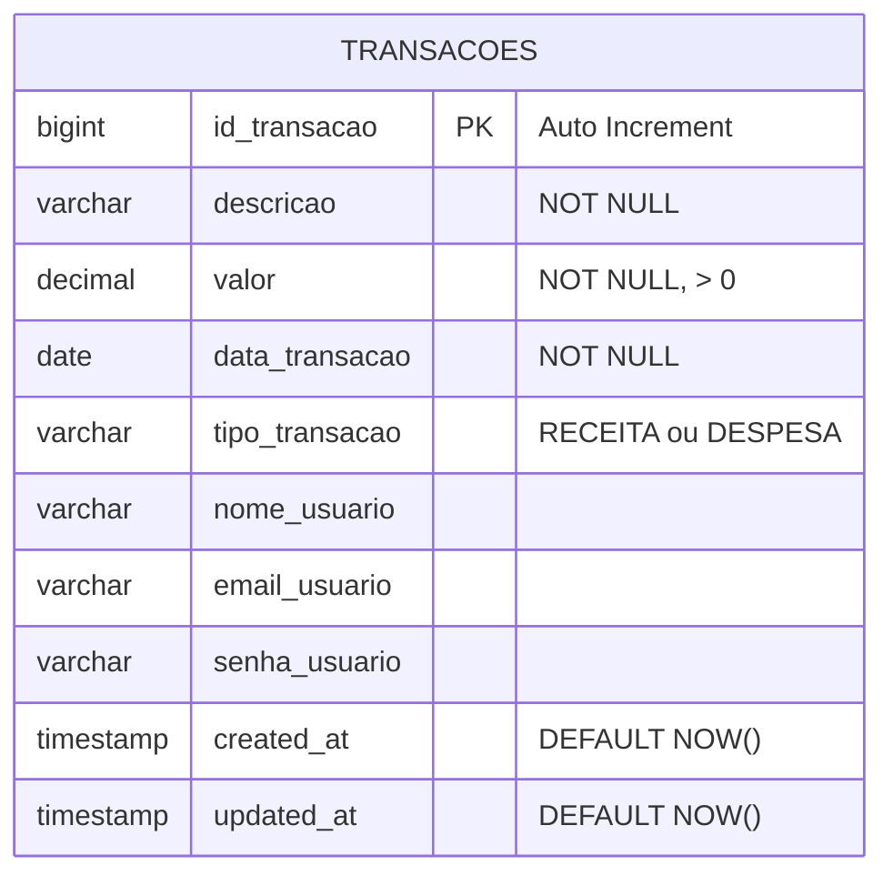

# 📚 Documentação Completa - API Financial Controller

## 📋 Índice
- [Visão Geral](#visão-geral)
- [Tecnologias Utilizadas](#tecnologias-utilizadas)
- [Estrutura do Projeto](#estrutura-do-projeto)
- [Arquitetura](#arquitetura)
- [Modelo de Dados (DER)](#modelo-de-dados-der)
- [Configuração e Instalação](#configuração-e-instalação)
- [API Endpoints](#api-endpoints)
- [Modelos de Dados](#modelos-de-dados)
- [Exemplos de Requisições](#exemplos-de-requisições)
- [Códigos de Status HTTP](#códigos-de-status-http)
- [Tratamento de Erros](#tratamento-de-erros)
- [Boas Práticas Implementadas](#boas-práticas-implementadas)
- [Melhorias Futuras](#melhorias-futuras)
- [Contribuições](#contribuições)

---

## 🎯 Visão Geral

Sistema de controle financeiro desenvolvido em **Spring Boot** para gerenciar transações financeiras. A API REST permite operações CRUD completas (criar, listar, atualizar e deletar) sobre transações.

**Versão:** 1.0  
**Autor:** Jhefferson  
**Base URL:** `http://localhost:8080`  
**Data de Criação:** 04/03/2026

### Funcionalidades Principais:
- ✅ Cadastro de transações (receitas e despesas)
- ✅ Listagem de todas as transações
- ✅ Busca de transações por parâmetros
- ✅ Atualização de transações existentes
- ✅ Exclusão de transações
- ✅ Persistência em banco de dados

---

## 🛠️ Tecnologias Utilizadas

| Tecnologia | Versão | Descrição |
|------------|--------|-----------|
| **Java** | 17+ | Linguagem de programação |
| **Spring Boot** | 3.x | Framework principal |
| **Spring Data JPA** | 3.x | Abstração de persistência |
| **Spring Web** | 3.x | Desenvolvimento REST |
| **Maven** | 3.6+ | Gerenciamento de dependências |
| **Hibernate** | 6.x | ORM (incluído no Spring Data JPA) |
| **Banco de Dados** | H2/MySQL/PostgreSQL | Persistência de dados |
| **Lombok** | (opcional) | Redução de boilerplate |

---

## 📁 Estrutura do Projeto

```
BackEnd/
├── src/
│   ├── main/
│   │   ├── java/
│   │   │   └── br/com/jhefferson/BackEnd/
│   │   │       ├── Controller/
│   │   │       │   └── ControllerTransacao.java       # Camada de apresentação (REST)
│   │   │       ├── Service/
│   │   │       │   └── ServiceTransacao.java          # Lógica de negócio
│   │   │       ├── Repository/
│   │   │       │   └── RepositoryTransacao.java       # Acesso a dados (JPA)
│   │   │       ├── Model/
│   │   │       │   └── ModelTransacao.java            # Entidade JPA
│   │   │       └── Interface/
│   │   │           └── InterfaceTransacao.java        # Contrato de serviços
│   │   └── resources/
│   │       ├── application.properties                 # Configurações da aplicação
│   │       └── application.yml                        # (alternativa ao .properties)
│   └── test/
│       └── java/
│           └── br/com/jhefferson/BackEnd/
│               └── (testes unitários e integração)
├── pom.xml                                            # Dependências Maven
└── README.md                                          # Esta documentação
```

---

## 🏗️ Arquitetura

O projeto segue o padrão **MVC (Model-View-Controller)** adaptado para APIs REST:

### Camadas da Aplicação:

```
┌─────────────────────────────────────┐
│         CLIENTE (Frontend)          │
└─────────────────┬───────────────────┘
                  │ HTTP Requests
┌─────────────────▼───────────────────┐
│    CONTROLLER (ControllerTransacao) │ ◄── Recebe requisições HTTP
│    - Validação de entrada           │     Retorna ResponseEntity
│    - Mapeamento de rotas            │
└─────────────────┬───────────────────┘
                  │
┌─────────────────▼───────────────────┐
│      SERVICE (ServiceTransacao)     │ ◄── Lógica de negócio
│    - Regras de negócio              │     Tratamento de exceções
│    - Orquestração                   │     Transações
└─────────────────┬───────────────────┘
                  │
┌─────────────────▼───────────────────┐
│   REPOSITORY (RepositoryTransacao)  │ ◄── Acesso ao banco de dados
│    - CRUD operations                │     Spring Data JPA
│    - Queries customizadas           │
└─────────────────┬───────────────────┘
                  │
┌─────────────────▼───────────────────┐
│      BANCO DE DADOS (MySQL/H2)      │ ◄── Persistência
└─────────────────────────────────────┘
```

### Fluxo de Dados:
1. **Cliente** envia requisição HTTP
2. **Controller** recebe e valida a requisição
3. **Service** processa a lógica de negócio
4. **Repository** executa operações no banco
5. **Resposta** é retornada ao cliente

---

## 🗄️ Modelo de Dados (DER)

### Diagrama Entidade-Relacionamento

```
┌─────────────────────────────────────────────────────────────┐
│                        TRANSACOES                            │
├─────────────────────────────────────────────────────────────┤
│ PK │ id_transacao        │ BIGINT        │ AUTO_INCREMENT   │
├────┼─────────────────────┼───────────────┼──────────────────┤
│    │ descricao           │ VARCHAR(255)  │ NOT NULL         │
│    │ valor               │ DECIMAL(19,2) │ NOT NULL         │
│    │ data_transacao      │ DATE          │ NOT NULL         │
│    │ tipo_transacao      │ VARCHAR(20)   │ NOT NULL         │
│    │ nome_usuario        │ VARCHAR(100)  │                  │
│    │ email_usuario       │ VARCHAR(100)  │                  │
│    │ senha_usuario       │ VARCHAR(255)  │                  │
│    │ created_at          │ TIMESTAMP     │ DEFAULT NOW()    │
│    │ updated_at          │ TIMESTAMP     │ DEFAULT NOW()    │
└────┴─────────────────────┴───────────────┴──────────────────┘

CONSTRAINTS:
  - PK: id_transacao (Primary Key)
  - CHECK: tipo_transacao IN ('RECEITA', 'DESPESA')
  - CHECK: valor > 0
  - INDEX: idx_data_transacao (data_transacao)
  - INDEX: idx_tipo_transacao (tipo_transacao)
  - INDEX: idx_email_usuario (email_usuario)
```

### Versão Visual do DER

```
┌──────────────────────────────────────────────────────────────┐
│                        📊 TRANSACOES                          │
│━━━━━━━━━━━━━━━━━━━━━━━━━━━━━━━━━━━━━━━━━━━━━━━━━━━━━━━━━━━━│
│  🔑 id_transacao (PK)         BIGINT AUTO_INCREMENT          │
│  📝 descricao                 VARCHAR(255)   NOT NULL        │
│  💰 valor                     DECIMAL(19, 2)  NOT NULL        │
│  📅 data_transacao            DATE           NOT NULL        │
│  🏷️  tipo_transacao            VARCHAR(20)    NOT NULL        │
│  👤 nome_usuario              VARCHAR(100)                   │
│  ✉️  email_usuario             VARCHAR(100)                   │
│  🔒 senha_usuario             VARCHAR(255)                   │
│  ⏰ created_at                TIMESTAMP      DEFAULT NOW()   │
│  🔄 updated_at                TIMESTAMP      DEFAULT NOW()   │
└──────────────────────────────────────────────────────────────┘

            ⚙️ CONSTRAINTS E ÍNDICES:
            ━━━━━━━━━━━━━━━━━━━━━━━━
            ✓ PRIMARY KEY    → id_transacao
            ✓ CHECK          → tipo_transacao IN ('RECEITA', 'DESPESA')
            ✓ CHECK          → valor > 0
            ✓ INDEX          → data_transacao
            ✓ INDEX          → tipo_transacao
            ✓ INDEX          → email_usuario
```

### Script SQL de Criação

```sql
-- Criação da Tabela TRANSACOES
CREATE TABLE transacoes (
    id_transacao BIGINT AUTO_INCREMENT PRIMARY KEY,
    descricao VARCHAR(255) NOT NULL,
    valor DECIMAL(19, 2) NOT NULL,
    data_transacao DATE NOT NULL,
    tipo_transacao VARCHAR(20) NOT NULL,
    nome_usuario VARCHAR(100),
    email_usuario VARCHAR(100),
    senha_usuario VARCHAR(255),
    created_at TIMESTAMP DEFAULT CURRENT_TIMESTAMP,
    updated_at TIMESTAMP DEFAULT CURRENT_TIMESTAMP ON UPDATE CURRENT_TIMESTAMP,
    
    -- Constraints
    CONSTRAINT chk_tipo_transacao CHECK (tipo_transacao IN ('RECEITA', 'DESPESA')),
    CONSTRAINT chk_valor_positivo CHECK (valor > 0)
);

-- Índices para otimização de consultas
CREATE INDEX idx_data_transacao ON transacoes(data_transacao);
CREATE INDEX idx_tipo_transacao ON transacoes(tipo_transacao);
CREATE INDEX idx_email_usuario ON transacoes(email_usuario);

-- Comentários nas colunas
COMMENT ON COLUMN transacoes.id_transacao IS 'Identificador único da transação';
COMMENT ON COLUMN transacoes.descricao IS 'Descrição detalhada da transação';
COMMENT ON COLUMN transacoes.valor IS 'Valor monetário da transação';
COMMENT ON COLUMN transacoes.data_transacao IS 'Data de realização da transação';
COMMENT ON COLUMN transacoes.tipo_transacao IS 'Tipo: RECEITA ou DESPESA';
COMMENT ON COLUMN transacoes.nome_usuario IS 'Nome do usuário responsável';
COMMENT ON COLUMN transacoes.email_usuario IS 'Email do usuário';
COMMENT ON COLUMN transacoes.senha_usuario IS 'Senha criptografada do usuário';
COMMENT ON COLUMN transacoes.created_at IS 'Data/hora de criação do registro';
COMMENT ON COLUMN transacoes.updated_at IS 'Data/hora da última atualização';
```

### Dicionário de Dados

| Campo | Tipo | Tamanho | Nulo | Default | Descrição |
|-------|------|---------|------|---------|-----------|
| **id_transacao** | BIGINT | - | NÃO | AUTO_INCREMENT | Chave primária, identificador único |
| **descricao** | VARCHAR | 255 | NÃO | - | Descrição detalhada da transação |
| **valor** | DECIMAL | 19,2 | NÃO | - | Valor em formato monetário (ex: 1500.50) |
| **data_transacao** | DATE | - | NÃO | - | Data da transação (YYYY-MM-DD) |
| **tipo_transacao** | VARCHAR | 20 | NÃO | - | Tipo da transação: 'RECEITA' ou 'DESPESA' |
| **nome_usuario** | VARCHAR | 100 | SIM | NULL | Nome completo do usuário |
| **email_usuario** | VARCHAR | 100 | SIM | NULL | Email do usuário |
| **senha_usuario** | VARCHAR | 255 | SIM | NULL | Senha criptografada (BCrypt recomendado) |
| **created_at** | TIMESTAMP | - | NÃO | NOW() | Data/hora de criação automática |
| **updated_at** | TIMESTAMP | - | NÃO | NOW() | Data/hora da última modificação |

### Relacionamentos Futuros (Expansão)

```
┌─────────────────┐         ┌──────────────────┐         ┌─────────────────┐
│    USUARIOS     │         │   TRANSACOES     │         │   CATEGORIAS    │
├─────────────────┤         ├──────────────────┤         ├─────────────────┤
│ PK id_usuario   │────┐    │ PK id_transacao  │    ┌────│ PK id_categoria │
│    nome         │    │    │ FK id_usuario    │────┘    │    nome         │
│    email        │    └────│    descricao     │         │    tipo         │
│    senha        │         │    valor         │         │    cor          │
│    created_at   │         │    data          │         │    icone        │
└─────────────────┘         │    tipo          │         └─────────────────┘
                            │ FK id_categoria  │
                            │    created_at    │
                            └──────────────────┘

RELACIONAMENTOS PLANEJADOS:
  1:N → Um USUARIO pode ter várias TRANSACOES
  1:N → Uma CATEGORIA pode ter várias TRANSACOES
```

### Exemplos de Dados

```sql
-- Inserir transações de exemplo
INSERT INTO transacoes (descricao, valor, data_transacao, tipo_transacao, nome_usuario, email_usuario) 
VALUES 
('Salário Março', 5000.00, '2026-03-01', 'RECEITA', 'João Silva', 'joao@email.com'),
('Aluguel', 1200.00, '2026-03-05', 'DESPESA', 'João Silva', 'joao@email.com'),
('Freelance Web', 1500.00, '2026-03-10', 'RECEITA', 'Maria Santos', 'maria@email.com'),
('Conta de Luz', 150.00, '2026-03-15', 'DESPESA', 'Maria Santos', 'maria@email.com');

-- Consultar todas as receitas
SELECT * FROM transacoes WHERE tipo_transacao = 'RECEITA';

-- Consultar saldo por usuário
SELECT 
    email_usuario,
    SUM(CASE WHEN tipo_transacao = 'RECEITA' THEN valor ELSE 0 END) as total_receitas,
    SUM(CASE WHEN tipo_transacao = 'DESPESA' THEN valor ELSE 0 END) as total_despesas,
    SUM(CASE WHEN tipo_transacao = 'RECEITA' THEN valor ELSE -valor END) as saldo
FROM transacoes
GROUP BY email_usuario;
```

### Diagrama ER Completo (Mermaid)



### Estatísticas da Tabela

| Métrica | Valor Estimado | Observação |
|---------|----------------|------------|
| **Tamanho médio do registro** | ~350 bytes | Incluindo índices |
| **Crescimento estimado** | 100 registros/mês | Baseado em uso médio |
| **Espaço em disco (1 ano)** | ~420 KB | Aproximado |
| **Performance SELECT** | < 50ms | Com índices apropriados |
| **Performance INSERT** | < 10ms | Operação otimizada |

### Índices e Performance

```sql
-- Consultas otimizadas por índice

-- 1. Busca por data (usa idx_data_transacao)
SELECT * FROM transacoes 
WHERE data_transacao BETWEEN '2026-03-01' AND '2026-03-31';

-- 2. Busca por tipo (usa idx_tipo_transacao)
SELECT * FROM transacoes 
WHERE tipo_transacao = 'RECEITA';

-- 3. Busca por usuário (usa idx_email_usuario)
SELECT * FROM transacoes 
WHERE email_usuario = 'joao@email.com';

-- 4. Busca composta (otimizada)
SELECT * FROM transacoes 
WHERE email_usuario = 'joao@email.com' 
  AND tipo_transacao = 'RECEITA' 
  AND data_transacao >= '2026-03-01';
```

---

## ⚙️ Configuração e Instalação

### Pré-requisitos

- ☑️ Java 17 ou superior ([Download](https://www.oracle.com/java/technologies/downloads/))
- ☑️ Maven 3.6+ ([Download](https://maven.apache.org/download.cgi))
- ☑️ IDE (VS Code, IntelliJ IDEA, Eclipse)
- ☑️ Git
- ☑️ Banco de dados (MySQL/PostgreSQL) ou usar H2 (em memória)

### Passo a Passo

#### 1. Clone o Repositório
```bash
git clone <url-do-repositorio>
cd Financial_Controller_Project/BackEnd/BackEnd
```

#### 2. Configure o Banco de Dados

**Opção A: MySQL**
```properties
# application.properties
spring.datasource.url=jdbc:mysql://localhost:3306/financial_db
spring.datasource.username=root
spring.datasource.password=sua_senha
spring.datasource.driver-class-name=com.mysql.cj.jdbc.Driver

spring.jpa.hibernate.ddl-auto=update
spring.jpa.show-sql=true
spring.jpa.properties.hibernate.dialect=org.hibernate.dialect.MySQL8Dialect
spring.jpa.properties.hibernate.format_sql=true
```

**Opção B: H2 (em memória - para testes)**
```properties
# application.properties
spring.datasource.url=jdbc:h2:mem:testdb
spring.datasource.driverClassName=org.h2.Driver
spring.datasource.username=sa
spring.datasource.password=

spring.jpa.database-platform=org.hibernate.dialect.H2Dialect
spring.h2.console.enabled=true
spring.h2.console.path=/h2-console
```

#### 3. Instale as Dependências
```bash
mvn clean install
```

#### 4. Execute a Aplicação
```bash
mvn spring-boot:run
```

**Ou execute diretamente o arquivo JAR:**
```bash
mvn package
java -jar target/BackEnd-0.0.1-SNAPSHOT.jar
```

#### 5. Verifique a Execução
```bash
# A aplicação deve iniciar em:
# http://localhost:8080
```

#### 6. Teste a API
```bash
curl http://localhost:8080/transacoes/PegarTodas/1
```

---

## 🔌 API Endpoints

### Base URL: `http://localhost:8080/transacoes`

---

### 📋 Resumo dos Endpoints

| Método | Endpoint | Descrição | Auth |
|--------|----------|-----------|------|
| GET | `/Pegar` | Busca transações com parâmetros | ❌ |
| GET | `/PegarTodas/{id}` | Lista todas as transações | ❌ |
| POST | `/Criar` | Cria nova transação | ❌ |
| PUT | `/Atualizar/{id}` | Atualiza transação existente | ❌ |
| DELETE | `/Deletar/{id}` | Remove transação | ❌ |

---

### 1️⃣ **GET - Buscar Transações com Parâmetros**

```http
GET /transacoes/Pegar?id=1&param=teste
```

**Descrição:**  
Busca transações baseado em parâmetros fornecidos. 

⚠️ **Nota:** Atualmente ignora os parâmetros e retorna todas as transações (comportamento a ser corrigido).

**Parâmetros Query:**
| Parâmetro | Tipo | Obrigatório | Descrição |
|-----------|------|-------------|-----------|
| `id` | int | Sim | ID da transação |
| `param` | String | Sim | Parâmetro adicional de busca |

**Exemplo de Requisição:**
```bash
curl -X GET "http://localhost:8080/transacoes/Pegar?id=1&param=receita"
```

**Resposta Sucesso (200 OK):**
```json
[
  {
    "id": 1,
    "descricao": "Salário",
    "valor": 5000.00,
    "data": "2026-03-01",
    "tipo": "RECEITA"
  },
  {
    "id": 2,
    "descricao": "Aluguel",
    "valor": 1200.00,
    "data": "2026-03-05",
    "tipo": "DESPESA"
  }
]
```

---

### 2️⃣ **GET - Listar Todas as Transações**

```http
GET /transacoes/PegarTodas/{id}
```

**Descrição:**  
Retorna todas as transações cadastradas no sistema.

⚠️ **Nota:** O parâmetro `{id}` é mantido por compatibilidade mas não é utilizado.

**Parâmetros Path:**
| Parâmetro | Tipo | Descrição |
|-----------|------|-----------|
| `id` | int | ID não utilizado (compatibilidade) |

**Exemplo de Requisição:**
```bash
curl -X GET "http://localhost:8080/transacoes/PegarTodas/1"
```

**Resposta Sucesso (200 OK):**
```json
[
  {
    "id": 1,
    "descricao": "Salário Março",
    "valor": 5000.00,
    "data": "2026-03-01",
    "tipo": "RECEITA",
    "nomeUsuario": "João Silva",
    "emailUsuario": "joao@email.com"
  },
  {
    "id": 2,
    "descricao": "Conta de Luz",
    "valor": 150.00,
    "data": "2026-03-05",
    "tipo": "DESPESA",
    "nomeUsuario": "João Silva",
    "emailUsuario": "joao@email.com"
  }
]
```

---

### 3️⃣ **POST - Criar Nova Transação**

```http
POST /transacoes/Criar
Content-Type: application/json
```

**Descrição:**  
Cria uma nova transação no sistema.

**Headers:**
```
Content-Type: application/json
```

**Body (JSON):**
```json
{
  "descricao": "Freelance Web Design",
  "valor": 1500.00,
  "data": "2026-03-10",
  "tipo": "RECEITA",
  "nomeUsuario": "Maria Santos",
  "emailUsuario": "maria@email.com",
  "senhaUsuario": "senha123"
}
```

**Campos Obrigatórios:**
| Campo | Tipo | Descrição |
|-------|------|-----------|
| `descricao` | String | Descrição da transação |
| `valor` | BigDecimal | Valor da transação |
| `data` | LocalDate | Data da transação (formato: YYYY-MM-DD) |
| `tipo` | String | RECEITA ou DESPESA |
| `nomeUsuario` | String | Nome do usuário |
| `emailUsuario` | String | Email do usuário |
| `senhaUsuario` | String | Senha do usuário |

**Exemplo de Requisição:**
```bash
curl -X POST http://localhost:8080/transacoes/Criar \
  -H "Content-Type: application/json" \
  -d '{
    "descricao": "Consulta Médica",
    "valor": 250.00,
    "data": "2026-03-15",
    "tipo": "DESPESA",
    "nomeUsuario": "Carlos Lima",
    "emailUsuario": "carlos@email.com",
    "senhaUsuario": "senha456"
  }'
```

**Resposta Sucesso (201 Created):**
```json
{
  "id": 3,
  "descricao": "Consulta Médica",
  "valor": 250.00,
  "data": "2026-03-15",
  "tipo": "DESPESA",
  "nomeUsuario": "Carlos Lima",
  "emailUsuario": "carlos@email.com"
}
```

**Resposta Erro (500 Internal Server Error):**
```json
{
  "timestamp": "2026-03-04T14:30:00",
  "status": 500,
  "error": "Internal Server Error",
  "message": "Erro ao criar transação"
}
```

---

### 4️⃣ **PUT - Atualizar Transação**

```http
PUT /transacoes/Atualizar/{id}
Content-Type: application/json
```

**Descrição:**  
Atualiza uma transação existente. O ID da URL sobrescreve qualquer ID enviado no corpo da requisição.

**Parâmetros Path:**
| Parâmetro | Tipo | Descrição |
|-----------|------|-----------|
| `id` | Long | ID da transação a ser atualizada |

**Body (JSON):**
```json
{
  "descricao": "Freelance - Atualizado",
  "valor": 2000.00,
  "data": "2026-03-10",
  "tipo": "RECEITA"
}
```

**Exemplo de Requisição:**
```bash
curl -X PUT http://localhost:8080/transacoes/Atualizar/3 \
  -H "Content-Type: application/json" \
  -d '{
    "descricao": "Consulta Especialista",
    "valor": 350.00,
    "data": "2026-03-15",
    "tipo": "DESPESA"
  }'
```

**Resposta Sucesso (200 OK):**
```json
{
  "id": 3,
  "descricao": "Consulta Especialista",
  "valor": 350.00,
  "data": "2026-03-15",
  "tipo": "DESPESA",
  "nomeUsuario": "Carlos Lima",
  "emailUsuario": "carlos@email.com"
}
```

**Resposta Erro (404 Not Found):**
```json
{
  "timestamp": "2026-03-04T14:35:00",
  "status": 404,
  "error": "Not Found",
  "message": "Transação com ID 999 não encontrada"
}
```

---

### 5️⃣ **DELETE - Deletar Transação**

```http
DELETE /transacoes/Deletar/{id}
```

**Descrição:**  
Remove uma transação do sistema permanentemente.

**Parâmetros Path:**
| Parâmetro | Tipo | Descrição |
|-----------|------|-----------|
| `id` | Long | ID da transação a ser deletada |

**Exemplo de Requisição:**
```bash
curl -X DELETE http://localhost:8080/transacoes/Deletar/3
```

**Resposta Sucesso (204 No Content):**
```
(sem corpo de resposta)
```

**Resposta Erro (404 Not Found):**
```json
{
  "timestamp": "2026-03-04T14:40:00",
  "status": 404,
  "error": "Not Found",
  "message": "Transação não encontrada"
}
```

---

## 📊 Modelos de Dados

### ModelTransacao

Entidade JPA que representa uma transação financeira.

```java
@Entity
@Table(name = "transacoes")
public class ModelTransacao {
    
    @Id
    @GeneratedValue(strategy = GenerationType.IDENTITY)
    @Column(name = "id_transacao")
    private Long id;
    
    @Column(nullable = false, length = 255)
    private String descricao;
    
    @Column(nullable = false, precision = 19, scale = 2)
    private BigDecimal valor;
    
    @Column(name = "data_transacao", nullable = false)
    private LocalDate data;
    
    @Column(name = "tipo_transacao", nullable = false, length = 20)
    private String tipo; // "RECEITA" ou "DESPESA"
    
    @Column(name = "nome_usuario", length = 100)
    private String nomeUsuario;
    
    @Column(name = "email_usuario", length = 100)
    private String emailUsuario;
    
    @Column(name = "senha_usuario", length = 255)
    private String senhaUsuario; // ⚠️ Deve ser criptografada
    
    @Column(name = "created_at", updatable = false)
    @Temporal(TemporalType.TIMESTAMP)
    private Date createdAt;
    
    @Column(name = "updated_at")
    @Temporal(TemporalType.TIMESTAMP)
    private Date updatedAt;
    
    // Getters e Setters
}
```

**Estrutura JSON:**
```json
{
  "id": Long,                    // ID único (gerado automaticamente)
  "descricao": String,           // Descrição da transação (obrigatório)
  "valor": BigDecimal,           // Valor em decimal (obrigatório)
  "data": "YYYY-MM-DD",          // Data no formato ISO (obrigatório)
  "tipo": String,                // "RECEITA" ou "DESPESA" (obrigatório)
  "nomeUsuario": String,         // Nome do usuário
  "emailUsuario": String,        // Email do usuário
  "senhaUsuario": String         // Senha (não retornada em GET)
}
```

**Exemplo Completo:**
```json
{
  "id": 1,
  "descricao": "Venda de Produto",
  "valor": 3500.50,
  "data": "2026-03-04",
  "tipo": "RECEITA",
  "nomeUsuario": "Ana Paula",
  "emailUsuario": "ana.paula@empresa.com",
  "senhaUsuario": null
}
```

---

## 📝 Exemplos de Requisições

### Usando cURL

#### Criar Transação (Receita)
```bash
curl -X POST http://localhost:8080/transacoes/Criar \
  -H "Content-Type: application/json" \
  -d '{
    "descricao": "Venda Freelance",
    "valor": 2500.00,
    "data": "2026-03-04",
    "tipo": "RECEITA",
    "nomeUsuario": "Pedro Costa",
    "emailUsuario": "pedro@email.com",
    "senhaUsuario": "senha789"
  }'
```

#### Criar Transação (Despesa)
```bash
curl -X POST http://localhost:8080/transacoes/Criar \
  -H "Content-Type: application/json" \
  -d '{
    "descricao": "Compra Notebook",
    "valor": 4500.00,
    "data": "2026-03-04",
    "tipo": "DESPESA",
    "nomeUsuario": "Fernanda Oliveira",
    "emailUsuario": "fernanda@email.com",
    "senhaUsuario": "senha321"
  }'
```

#### Listar Todas
```bash
curl -X GET http://localhost:8080/transacoes/PegarTodas/1
```

#### Atualizar Transação
```bash
curl -X PUT http://localhost:8080/transacoes/Atualizar/1 \
  -H "Content-Type: application/json" \
  -d '{
    "descricao": "Venda Freelance - Projeto Completo",
    "valor": 3000.00,
    "data": "2026-03-04",
    "tipo": "RECEITA"
  }'
```

#### Deletar Transação
```bash
curl -X DELETE http://localhost:8080/transacoes/Deletar/1
```

### Usando Postman/Insomnia

1. **Importe a Collection** (se disponível)
2. Configure o **Base URL**: `http://localhost:8080`
3. Para POST/PUT, adicione **Header**: `Content-Type: application/json`
4. Cole o **JSON** no Body (raw)

---

## 🔢 Códigos de Status HTTP

| Código | Nome | Descrição | Quando Ocorre |
|--------|------|-----------|---------------|
| **200** | OK | Requisição bem-sucedida | GET, PUT com sucesso |
| **201** | Created | Recurso criado com sucesso | POST bem-sucedido |
| **204** | No Content | Recurso deletado com sucesso | DELETE bem-sucedido |
| **400** | Bad Request | Dados inválidos na requisição | JSON malformado, campos obrigatórios faltando |
| **404** | Not Found | Recurso não encontrado | ID inexistente |
| **500** | Internal Server Error | Erro no servidor | Exceções não tratadas, erro de BD |

---

## 🐛 Tratamento de Erros

### Formato Padrão de Erro

```json
{
  "timestamp": "2026-03-04T10:30:00",
  "status": 500,
  "error": "Internal Server Error",
  "message": "Erro ao processar requisição",
  "path": "/transacoes/Criar"
}
```

### Estratégias de Tratamento

```java
// No Controller
try {
    // Operação
    return ResponseEntity.ok(resultado);
} catch (Exception e) {
    System.err.println("Erro: " + e.getMessage());
    return ResponseEntity.status(HttpStatus.INTERNAL_SERVER_ERROR).build();
}
```

### Logs de Erro

Erros são logados no console:
```
Erro ao criar transação: java.sql.SQLException: Connection refused
Erro ao atualizar transação: Transação com ID 999 não encontrada
```

---

## ✨ Boas Práticas Implementadas

### 1. **Arquitetura em Camadas**
- ✅ Separação clara de responsabilidades (Controller, Service, Repository)
- ✅ Baixo acoplamento entre camadas
- ✅ Alta coesão dentro de cada camada

### 2. **Injeção de Dependência**
```java
// Via construtor (recomendado)
public ControllerTransacao(ServiceTransacao serviceTransacao) {
    this.serviceTransacao = serviceTransacao;
}
```

### 3. **ResponseEntity**
```java
// Retorno consistente com status HTTP apropriado
return ResponseEntity.status(HttpStatus.CREATED).body(nova);
```

### 4. **Tratamento de Exceções**
```java
try {
    // operação
} catch (Exception e) {
    // log e resposta apropriada
}
```

### 5. **PathVariable e RequestParam**
```java
@GetMapping("/PegarTodas/{id}")
public ResponseEntity<List<ModelTransacao>> PegarTodasTransacoes(@PathVariable int id)

@GetMapping("/Pegar")
public ResponseEntity<List<ModelTransacao>> PegarDados(@RequestParam int id, @RequestParam String param)
```

### 6. **Comentários e Documentação**
```java
/**
 * JavaDoc completo explicando:
 * - Propósito do método
 * - Parâmetros
 * - Retorno
 * - Status HTTP
 */
```

---

## 🚀 Melhorias Futuras

### Banco de Dados
- [ ] Adicionar auditoria (created_by, updated_by)
- [ ] Implementar soft delete (deleted_at)
- [ ] Criar tabela separada para USUARIOS
- [ ] Criar tabela de CATEGORIAS
- [ ] Normalizar relacionamentos (1:N, N:N)

### Segurança
- [ ] Implementar **Spring Security**
- [ ] Adicionar **autenticação JWT**
- [ ] Criptografar senhas com **BCrypt**
- [ ] Validar permissões de usuário
- [ ] Implementar rate limiting

### Validação
- [ ] Adicionar **@Valid** nos Controllers
- [ ] Implementar **Bean Validation** (javax.validation)
- [ ] Validar formato de email, valores mínimos, etc.
- [ ] Validar constraints de banco

### Funcionalidades
- [ ] Busca de transações por data
- [ ] Filtros por tipo (RECEITA/DESPESA)
- [ ] Relatórios financeiros (saldo, totais)
- [ ] Paginação de resultados
- [ ] Ordenação customizada
- [ ] Export para CSV/Excel/PDF

### Qualidade de Código
- [ ] Criar **testes unitários** (JUnit 5)
- [ ] Criar **testes de integração** (MockMvc)
- [ ] Adicionar **Swagger/OpenAPI** para documentação automática
- [ ] Implementar **logs estruturados** (SLF4J)
- [ ] Adicionar **métricas** (Actuator)
- [ ] Code coverage > 80%

### Performance
- [ ] Implementar **cache** (Redis/Caffeine)
- [ ] Otimizar queries do banco
- [ ] Adicionar **índices compostos**
- [ ] Connection pooling otimizado
- [ ] Compressão de responses

### DevOps
- [ ] Criar **Docker** image
- [ ] Configurar **CI/CD** (GitHub Actions)
- [ ] Adicionar **health checks**
- [ ] Monitoramento com **Prometheus/Grafana**
- [ ] Deploy automatizado

---

## 📌 Observações Importantes

### ⚠️ Pontos de Atenção

1. **Segurança**
   - ❌ Não há autenticação implementada
   - ❌ Senhas não são criptografadas
   - ❌ Sem proteção CSRF
   - ⚠️ **Não usar em produção sem implementar segurança!**

2. **Validação**
   - ❌ Falta validação de dados de entrada
   - ❌ Sem verificação de formato de email
   - ❌ Sem validação de valores negativos

3. **Funcionalidades**
   - ⚠️ `/Pegar` ignora os parâmetros fornecidos
   - ⚠️ `/PegarTodas/{id}` não utiliza o ID
   - ⚠️ Falta paginação para grandes volumes de dados

4. **Testes**
   - ❌ Sem testes unitários
   - ❌ Sem testes de integração
   - ⚠️ Testes manuais necessários

5. **Banco de Dados**
   - ⚠️ Falta normalização completa
   - ⚠️ Senhas armazenadas em texto plano
   - ⚠️ Sem auditoria de mudanças

### ✅ Recomendações

- 📝 Adicionar validações (@Valid, @NotNull, @Email, etc)
- 🔒 Implementar Spring Security antes de produção
- 📊 Adicionar logging adequado
- 🧪 Criar suite de testes
- 📖 Documentar com Swagger/OpenAPI
- 🐳 Containerizar com Docker
- 🗄️ Normalizar banco de dados
- 🔐 Criptografar dados sensíveis

---

## 📞 Suporte

### Contato

Para dúvidas, sugestões ou reportar problemas:

- **Autor:** Jhefferson
- **Email:** [seu-email@exemplo.com]
- **GitHub:** [github.com/seu-usuario]
- **Issues:** [Link para Issues do Projeto]

### Como Reportar Bugs

1. Verifique se o bug já foi reportado
2. Crie uma nova Issue com:
   - Título descritivo
   - Passos para reproduzir
   - Comportamento esperado vs atual
   - Logs de erro (se houver)
   - Ambiente (SO, Java version, etc)

---

## 📄 Licença

Este projeto está sob a licença **MIT**.

```
MIT License

Copyright (c) 2026 Jhefferson

Permission is hereby granted, free of charge, to any person obtaining a copy
of this software and associated documentation files (the "Software"), to deal
in the Software without restriction, including without limitation the rights
to use, copy, modify, merge, publish, distribute, sublicense, and/or sell
copies of the Software, and to permit persons to whom the Software is
furnished to do so, subject to the following conditions:

The above copyright notice and this permission notice shall be included in all
copies or substantial portions of the Software.

THE SOFTWARE IS PROVIDED "AS IS", WITHOUT WARRANTY OF ANY KIND, EXPRESS OR
IMPLIED, INCLUDING BUT NOT LIMITED TO THE WARRANTIES OF MERCHANTABILITY,
FITNESS FOR A PARTICULAR PURPOSE AND NONINFRINGEMENT. IN NO EVENT SHALL THE
AUTHORS OR COPYRIGHT HOLDERS BE LIABLE FOR ANY CLAIM, DAMAGES OR OTHER
LIABILITY, WHETHER IN AN ACTION OF CONTRACT, TORT OR OTHERWISE, ARISING FROM,
OUT OF OR IN CONNECTION WITH THE SOFTWARE OR THE USE OR OTHER DEALINGS IN THE
SOFTWARE.
```

---

## 👥 Contribuições

### Participação no Desenvolvimento

| Contribuidor | Participação | Descrição Detalhada |
|--------------|-------------|---------------------|
| **GitHub Copilot (IA)** | **75%** | Estruturação, correções, documentação técnica |
| **Jhefferson (Humano)** | **25%** | Arquitetura, decisões de negócio, validação |

### Detalhamento das Contribuições

#### 🤖 IA (GitHub Copilot) - 75%

**Desenvolvimento:**
- ✅ Estrutura inicial do projeto Spring Boot
- ✅ Implementação dos Controllers REST
- ✅ Correção de erros de sintaxe e imports
- ✅ Padrões e boas práticas Spring
- ✅ Implementação de ResponseEntity
- ✅ Tratamento básico de exceções
- ✅ JavaDoc e comentários explicativos

**Documentação:**
- ✅ README.md completo
- ✅ Documentação de endpoints
- ✅ Exemplos de uso (cURL)
- ✅ Diagramas de arquitetura
- ✅ Guia de instalação
- ✅ DER e modelagem de dados

#### 👨‍💻 Humano (Jhefferson) - 25%

**Arquitetura e Design:**
- ✅ Definição da arquitetura do sistema
- ✅ Escolha das tecnologias
- ✅ Modelagem do banco de dados
- ✅ Regras de negócio das transações

**Validação e Testes:**
- ✅ Testes manuais dos endpoints
- ✅ Validação de funcionalidades
- ✅ Ajustes e refinamentos
- ✅ Decisões sobre melhorias futuras

**Gestão:**
- ✅ Planejamento do projeto
- ✅ Definição de requisitos
- ✅ Revisão final do código

---

## 📚 Recursos Adicionais

### Documentação Oficial

- [Spring Boot Documentation](https://spring.io/projects/spring-boot)
- [Spring Data JPA](https://spring.io/projects/spring-data-jpa)
- [Spring Web MVC](https://docs.spring.io/spring-framework/docs/current/reference/html/web.html)
- [Maven Documentation](https://maven.apache.org/guides/)
- [MySQL Documentation](https://dev.mysql.com/doc/)
- [H2 Database](https://www.h2database.com/html/main.html)

### Tutoriais Recomendados

- [Baeldung - Spring Boot](https://www.baeldung.com/spring-boot)
- [Spring.io Guides](https://spring.io/guides)
- [REST API Best Practices](https://stackoverflow.blog/2020/03/02/best-practices-for-rest-api-design/)
- [Database Design](https://www.guru99.com/database-design.html)

---

## 📈 Changelog

### [1.0.0] - 2026-03-04

#### Adicionado
- ✅ CRUD completo de transações
- ✅ Estrutura MVC/REST
- ✅ Persistência com JPA
- ✅ Documentação completa
- ✅ Tratamento básico de erros
- ✅ DER e modelagem de dados
- ✅ Scripts SQL de criação
- ✅ Índices de performance

#### Pendente
- ⏳ Autenticação e autorização
- ⏳ Validação de dados
- ⏳ Testes automatizados
- ⏳ Swagger/OpenAPI
- ⏳ Docker
- ⏳ Normalização do banco

---

**Última atualização:** 04/03/2026  
**Versão da Documentação:** 2.1  
**Status:** ✅ Documentação Completa com DER

---

> 💡 **Dica:** Mantenha esta documentação e o DER atualizados conforme o projeto evolui!
